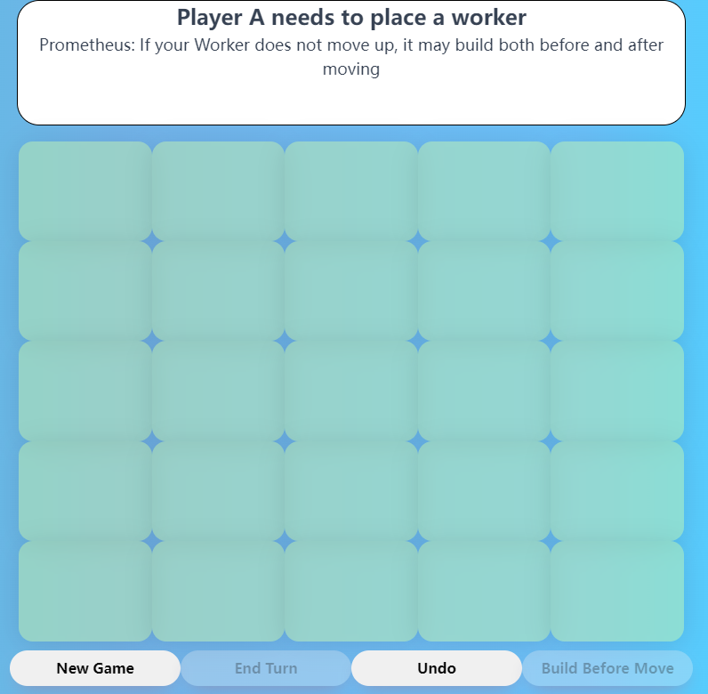

## Starting a Game
1. Start Back-end Server
```
cd back-end
mvn site
mvn exec:exec
```
2. Start Front-end Server in a separate terminal
```
cd front-end
npm install
npm start
```
3. Play the Game!
The game will be available at <http://localhost:3000>


## God Cards
- **Demeter** - build twice!
    - Ability: After first build, you can skip the second build
- **Pan** - fall to win!
- **Minotaur** - knock opponent out of your way!
- **Apollo** - steal spotlight from your opponent!
- **Artemis** - move twice!
    - Ability: After first move, you can skip the second move
- **Athena** - ban opponent from climbing up!
- **Atlas** - trap opponent with domes!
    - Ability: When building, choose block or dome
- **Hephaestus** - build two levels!
    - Ability: After first build, you can skip the second build
- **Hermes** - move as much as you want!
    - Ability1: If not moved yet, you can choose to not move at all
    - Ability2: While moving, you can always switch a worker to move
- **Prometheus** - build before move!
    - Ability: Before move, you can choose to build beforehand

## Undo
I have made all classes in HW3 immutable. Each class now has all attributes defined as final, and any setter or method that updates the state will return an updated version of itself. All arrays are copied before being returned, so it is impossible to modify array-like data from outside of the class.

## AI
At the beginning of a game, when choosing god cards, there is a checkbox displayed below each player. Checking the box enables the AI for that player. Once enabled, the player's ability button will display "AUTO". You can control the AI gameplay using this "AUTO" button.

Additionally, the AI is capable of using god cards and knows how to use their abilities, such as skipping a build.


The AI agent is an extension to all GameActions' implementation. It is implemented as a decorator class that can decorate other god cards or the basic game. It uses the Minimax algorithm and evaluates the game board based on the current height of the workers and the number of surrounding towers.


## Appendix 1: Santorini Rules

Santorini has very simple rules, but the game is very extensible. You can find the original rules [online](https://roxley.com/products/santorini).


